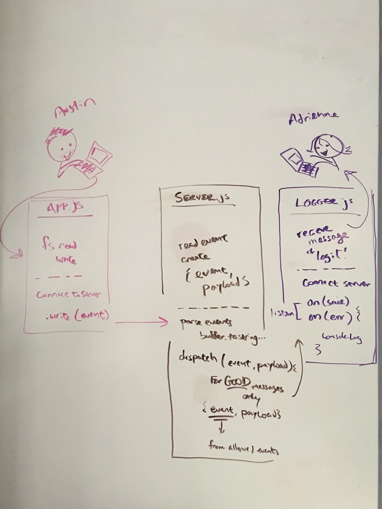

# LAB - 17

## Project TCP-Messenger

### Author: Ai

### Links and Resources
* [submission PR](https://github.com/401-advanced-javascript-aimurphy/17-TCP-Messenger/pull/2)
* 
* [back-end](https://apm-tcp-mssngr.herokuapp.com/) (heroku)
* [front-end](http://xyz.com) (when applicable)

#### Documentation
* [api docs](./) (API servers)
* [jsdoc](http://apm-tcp-mssngr.herokuapp.com/docs/index.html) (Server assignments)
* [styleguide](http://xyz.com) (React assignments)

### Modules
#### `logger.js`
##### event.on() will be listening for and reacting to any `error` and any `fs.write`.

###### `method`
This is our listener, we are going to create a handler function to be used as a callback for this function

###### `method`

### Setup
#### `.env` requirements
* PORT 3001

#### Running the app
* `node app.js`
* Endpoint: `/app/`
  * Runs our fs read and write.

  
#### Tests
* Run tests by running `npm test` in your terminal
* This test is not yet created! So don't try 👆that yet!
* What assertions need to be / should be made?

#### UML

